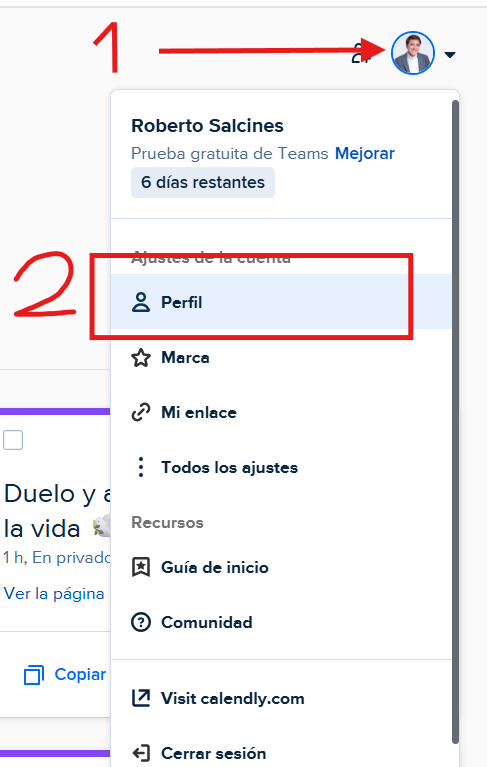
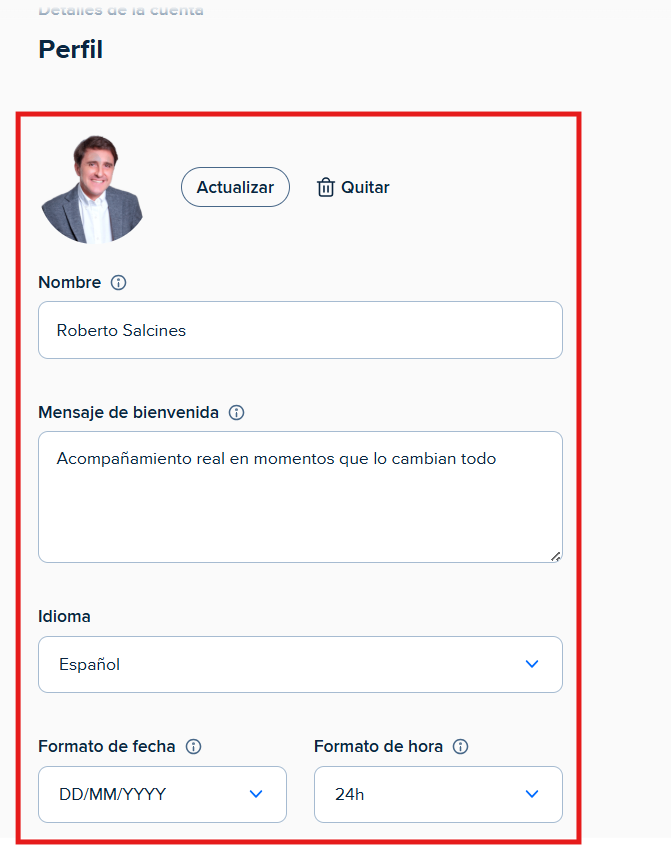

# Configurar el perfil
---
Puede configurar su perfil de calendly de la siguiente manera:

**Paso 1**: Haga click encima de la foto de su perfil o donde estaria dicha foto y haga click encima del apartado de **perfil**.

---

**Paso 2**: Inserte o cambie su foto de perfil, su nombre, el mensaje de bienvenida, el idioma, el formato de fecha, el formato de hora, su pais y su zona horaria. **Importante**: Asegurese de dar al boton de **Guardar los cambios** para que guarde todos los cambios realizados.

