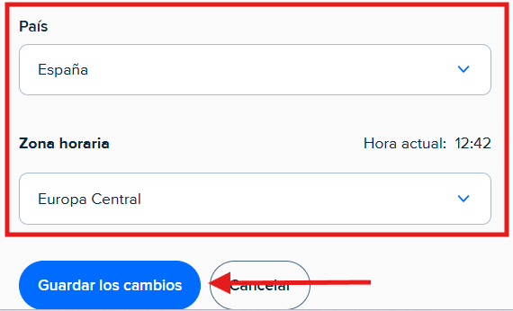
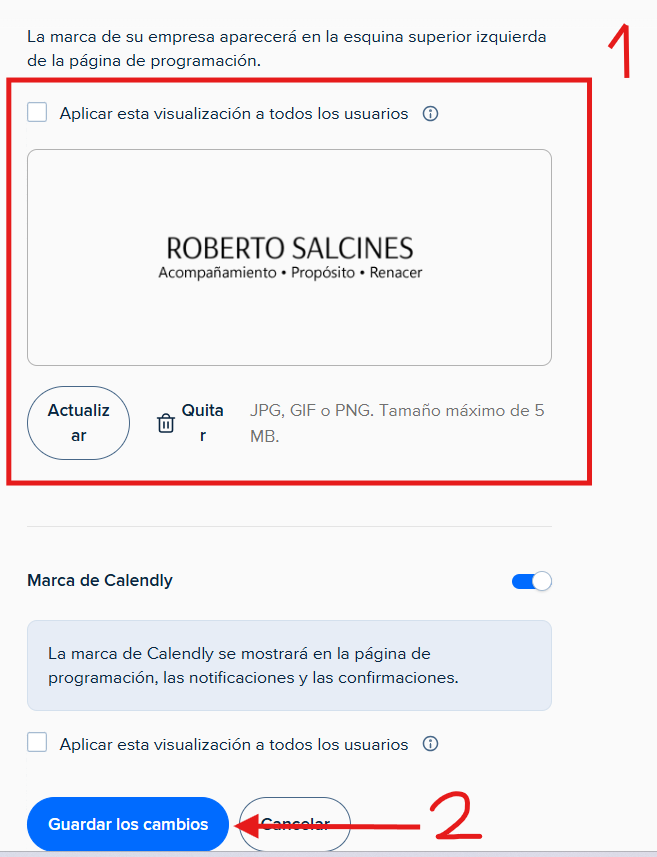

# Configurar la marca
---
Puede configurar la marca de su empresa en calendly de la siguiente manera:

**Paso 1**: Haga click encima de la foto de su perfil o donde estaria dicha foto y haga click encima del apartado de **marca**.

---

**Paso 2**: Inserte o cambie el logo de su marca. **Importante**: Asegurese de dar al boton de **Guardar los cambios** para que guarde todos los cambios realizados.
