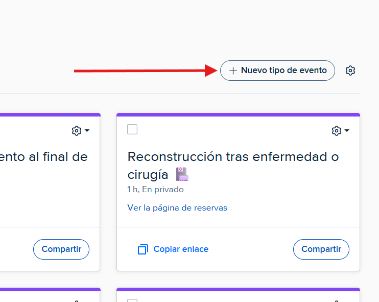
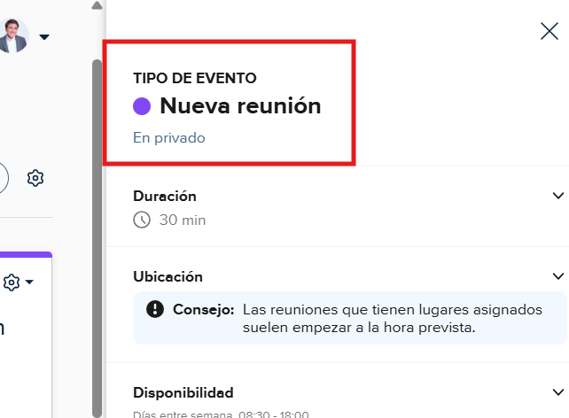

# Crear un nuevo evento
---
Puede crear un nuevo evento de la siguiente manera:

**Paso 1**: Haga click en el boton de **+Nuevo tipo de evento**.

---

**Paso 2**: Seleccione que tipo de evento desea crear.

---

**Paso 3**: Inserte el nombre que tendra su evento.

---

**Paso 4**: Seleccione la duración del evento.

---

**Paso 5**: Escoga si su evento se hara en presencial, por llamada, u otro tipo de forma. Y despues meta los datos relacionados con esa forma de evento.

---

**Paso 6**: Configure los ajustes de disponibilidad del evento. Que tanto tiempo en el futuro podra hacer la reservar, con cuanto tiempo de antelación se podra hacer la reserva, que dias de la semana y en que horario se podra hacer la reserva...

---

**Paso 7**: Haga click en la opción que diga, **Más opciones**.

---

**Paso 8**: Configure los siguientes apartados que aparecen en la imagen. **Importante**: Se recomienda como minimo configurar la descripción y el metodo de pago. **Asegurese** de **guardar** todos los cambios realizados.

