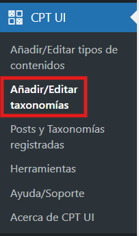
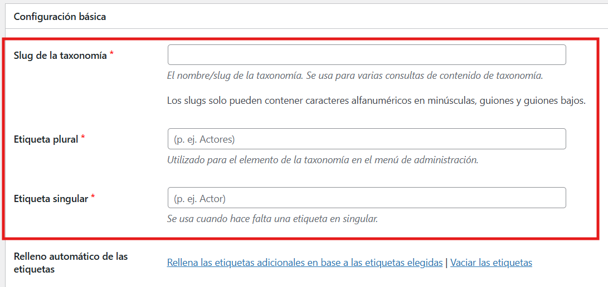
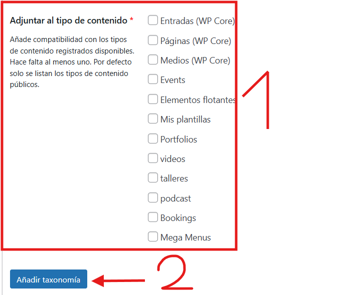

# Crear nuevas taxonomías
---
Por defecto, wordpress viene con las taxonomías de Etiquetas y Categorias. Si quiere crear nuevas taxonomías, puede crearlas de la siguiente manera:

**Paso 1**: Puede crear una nueva taxonomia en **CPT UI** > **Añadir/Editar taxonomías**.

---

**Paso 2**: Aquí tendras que rellenar todos los campos de texto.
**Importate**: Se recomienda usar el mismo nombre en todos los campos de texto.

---

**Paso 3**: Tendras que escoger en que tipos de contenidos quieres que se añada esta nueva taxonomía. Al terminar tendras que darle al boton de **Añadir taxonomía**.
