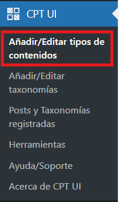
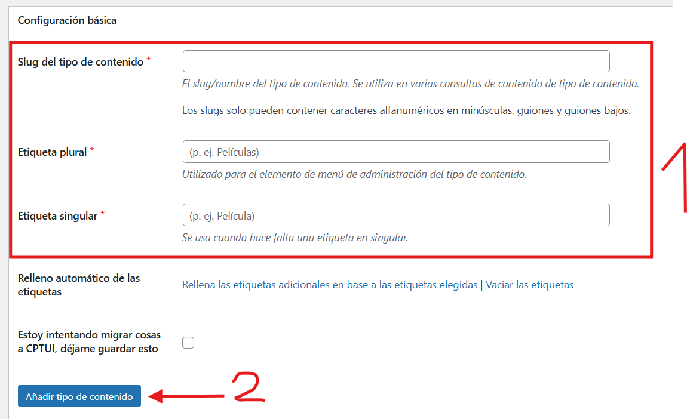

# Crear nuevos tipos de contenido
---
Puedes crear nuevos tipos de contenido de la siguiente manera:

**Paso 1**: Puedes crear un nuevo tipo de contenido en **CPT UI** > **Añadir/Editar tipos de contenidos**.

---

**Paso 2**: Aquí tendras que rellenar todos los campos de texto. Despues le tendras que dar al boton de **"Añadir tipo de contenido"**.
**Importate**: Se recomienda usar el mismo nombre en todos los campos de texto.
