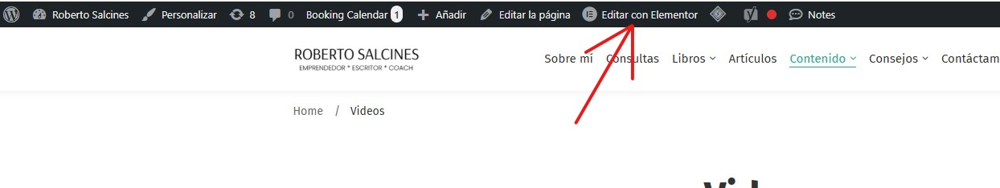
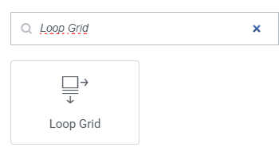
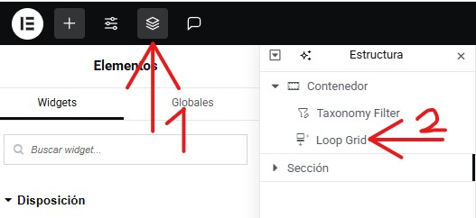

# Filtrar publicaciones por taxonomías
---
Puede filtrar publicaciones mediante el uso de taxonomias de la siguiente manera:
**Importante** Si ya tiene un taxonomy filter y un Loop Grip  agregado con elementor, vaya hasta **paso numero 4**. 

**Paso 1**: Vaya a la pagina donde vaya donde desee filtrar con una taxonomia.

---

**Paso 2**: Edita la pagina haciendo click en la opcion de **"Editar con Elementor"** que encontraras en la **parte superior** de la pagina

---

**Paso 3**: Añada un **Loop Grid** y un **taxonomy filter** a la pagina que este editando desde la columna que le saldra en la parte izquierda de la pagina **Elementos** > **Widgets**.

---

**Paso 4**: Seleccione el Loop Grid desde la opción de **Estructura**, de la misma forma que en la siguiente imagen: 

---

**Paso 5**: Busque la sección de **Query**, y en el apartado de **Source**, al hacer click encima se abrira un menu desplegable con todos los diferentes tipos de contenido que hay. Eliga el tipo de contenido que querra mostrar y filtrar con la taxonomía.

**Paso 6** Busque la sección de **Pagination** y configure los siguientes apartados. Primero, en el apartado de **Pagination**, haga click encima de el. Al hacerlo, le saldra un menu desplegable con las distintas formas en las que se vera a la hora de cambiar entre las paginas de las publicaciones. Despues, ponga el limite de paginas que guardaran sus publicaciones. Para finalizar, eliga la alineacion de la parte para navegar entre paginas.
**Importante**: Tenga en cuenta que se puede cambiar en el futuro.

---

**Paso 7**: Seleccione el Taxonomy Filter desde **Estructura** o **haciendo click encima del filtro**. Al hacerlo, busque la sección de **Layout**. Al hacerlo tendra que modificar los siguientes apartados. Primero, al hacer click encima del apartado de **Selected loop grid**, aparecera un menu desplegable con los distintos Loop Grid que alla creado. Seleccione el que quiera filtrar. Despues, tendra que configurar el apartado de **Taxonomy** en el que tendra que escoger que taxonomía en concreto quiere utilizar para filtrar. Para finalizar, configure el apartado de **Item Aligment** para elegir si quiere que el apartado para filtrar aparezca a la izquierda, derecha o centrado en dicha pagina.
 