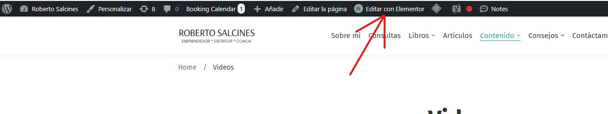
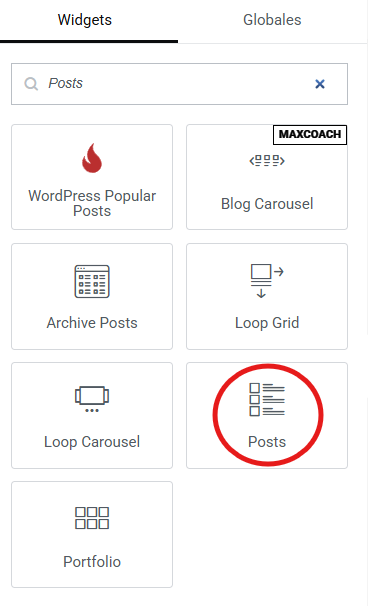
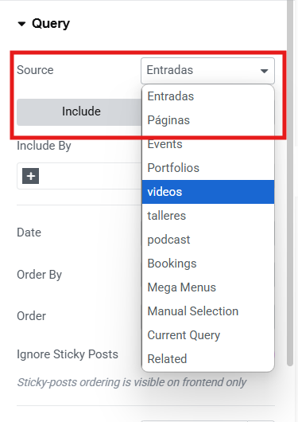
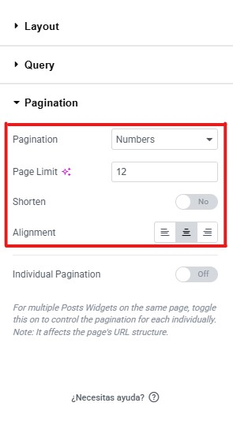
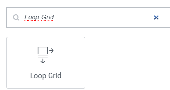
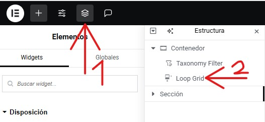
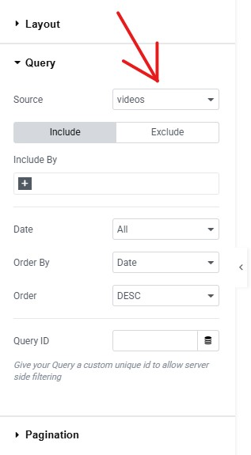

# Gestionar o Mostrar tipos de contenidos
---
Puede mostrar los tipos de contenidos en un Posts o en un Loop Grid de la siguiente manera:
**Importante**: El **Paso 1** y el **Paso 2** sera comun para ambos metodos. Paro a partir de hay, se explicara como hacerlo con **Posts** desde el **Paso 3 al Paso 6**, mientras que con **Loop Grid** Se explicara desde el **Paso 7 al Paso 10**.

**Paso 1**: Vaya a la pagina donde vaya donde desee filtrar con una taxonomia.

---

**Paso 2**: Edita la pagina haciendo click en la opcion de **"Editar con Elementor"** que encontraras en la **parte superior** de la pagina

---

**Paso 3**: Añada un **Posts** a la pagina que este editando desde la columna que le saldra en la parte izquierda de la pagina **Elementos** > **Widgets**.

---

**Paso 4**: Seleccione el Posts **haciendo click encima** suyo.

---

**Paso 5**: Busque la sección de **Query** y seleccione el apartado de **Source**. Al hacer click encima, aparecera un menu desplegable en el que apareceran todos los tipos de contenidos que tenga. Seleccione el que quiere mostrar. 

**Importante**: Si va a subir mucha publicaciones, es recomendable que tambien haga el paso 6.

**Paso 6** Busque la sección de **Pagination** y configure los siguientes apartados. Primero, en el apartado de **Pagination**, haga click encima de el. Al hacerlo, le saldra un menu desplegable con las distintas formas en las que se vera a la hora de cambiar entre las paginas de las publicaciones. Despues, ponga el limite de paginas que guardaran sus publicaciones. Para finalizar, eliga la alineacion de la parte para navegar entre paginas.
**Importante**: Tenga en cuenta que se puede cambiar en el futuro.

---

**Paso 7**: Añada un **Loop Grid** a la pagina que este editando desde la columna que le saldra en la parte izquierda de la pagina **Elementos** > **Widgets**.

---

**Paso 8**: Seleccione el Loop Grid desde la opción de **Estructura**, de la misma forma que en la siguiente imagen: 

---

**Paso 9**: Busque la sección de **Query**, y en el apartado de **Source**, al hacer click encima se abrira un menu desplegable con todos los diferentes tipos de contenido que hay. Eliga el tipo de contenido que quiera mostrar.

---

**Paso 10** Busque la sección de **Pagination** y configure los siguientes apartados. Primero, en el apartado de **Pagination**, haga click encima de el. Al hacerlo, le saldra un menu desplegable con las distintas formas en las que se vera a la hora de cambiar entre las paginas de las publicaciones. Despues, ponga el limite de paginas que guardaran sus publicaciones. Para finalizar, eliga la alineacion de la parte para navegar entre paginas.
**Importante**: Tenga en cuenta que se puede cambiar en el futuro.

