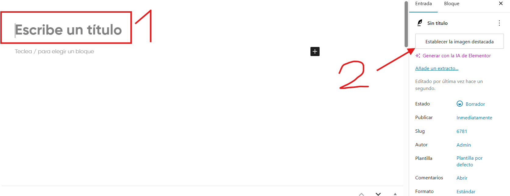
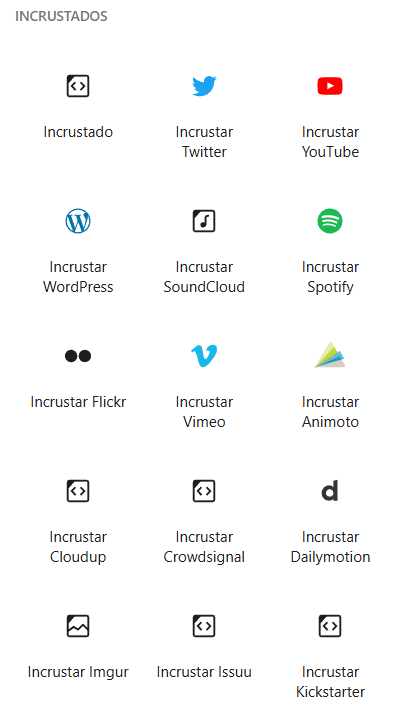

# Publicar nuevos articulos o talleres
---
Puede publicar nuevos articulos o talleres de la siguiente manera:

**Paso 1**: Si quiere publicar un nuevo articulo, entre en **Entradas** > **Añadir entrada**. Por otra parte, si quiere publicar un nuevo taller, entre en **talleres** > **Añadir nuevo talleres**.

---

**Paso 2**: Añada un titulo y una foto para su articulo o taller.
**Importante**: Tenga en cuenta que la foto y el titulo se mostraran al entrar en el blog por lo que no es necesario volvera a ponerlos cuando comience a escribir el contenido de su articulo. 

---

**Paso 3**: Añada el contenido del articulo o del taller. Para ello, dispondra de multiples tipos de bloque para insertar. 

**Bloques de Texto**: Ideales para añadir texto en distintos escenarios de tu articulo o taller.

---

**Bloques de Medios**: Ideales para añadir diferentes tipos de medios a tu articulo o taller.

---

**Bloques de Diseño**: Ideales para mejorar el diseño y para añadir botones a tu articulo o taller.

---

**Bloques de Widgets**: Ideales para añadir diferentes tipos de herramientas a tu articulo o taller.

---

**Bloques de Tema**: Ideales para añadir mas herramientas u otros datos sobre el articulo o taller para estos.

---

**Bloques de Incrustados**: Ideales para incrustar diferentes redes sociales en tu articulo o taller.

---

**Bloques de Yoast de Datos Estructurados**: Estos bloques son componentes del editor de bloques de WordPress que generan automáticamente el JSON-LD necesario para rich results al insertar FAQ, How-To, recetas, Q&A, datasets y más elementos estructurados en tu contenido.

---

**Bloques de Yoast de Enlazado Interno**: Son ideales para insertar fácilmente listas de enlaces basadas en la jerarquía y relevancia de tu sitio.

**Bloques de Tema**: Estos son otros diferentes bloques de tema que son usados para las diferentes partes de la pagina. Desde el header, hasta el footer.
