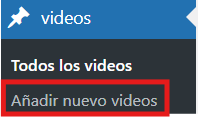
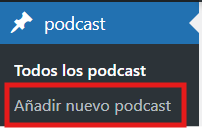
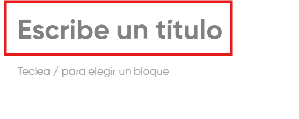
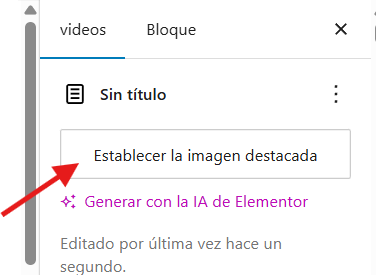
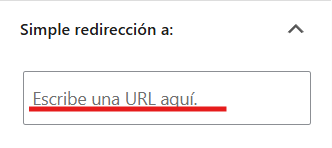

# Publicar nuevos videos o podcast
---
Puede publicar nuevos videos o podcast de la siguiente manera:

**Paso 1**: Si quiere publicar un nuevo video, entre en **videos** > **Añadir nuevo videos**. Por otra parte, si quiere publicar un nuevo podcast, entre en **podcast** > **Añadir nuevo podcast**.

---

**Paso 2**: Añada el **titulo** de su video o podcast.

---

**Paso 3**: Añada la **miniatura** de su video o podcast.

---

**Paso 4**: Añada el **link/URL** que lo mande a su video o podcast.

**Importante**: Se usan redirecciones para no saturar la pagina con videos. De lo contrario, al tener un servidor con menos recursos, la pagina podria ralentizarse al tener que cargar archivos pesados como son los videos. Por lo que es recomendable usar redirecciones. Ademas de ofrecer una mayor comodidad.
