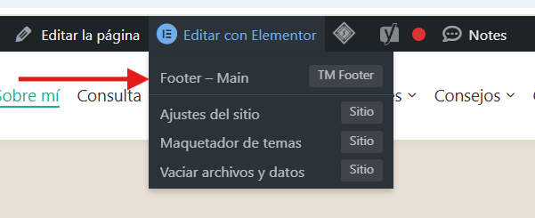
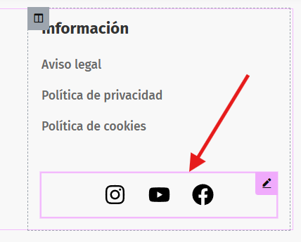
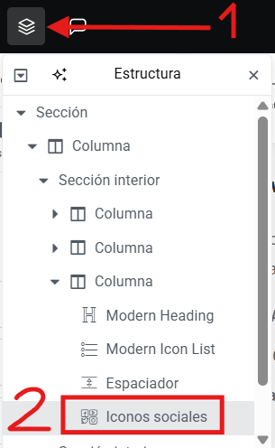
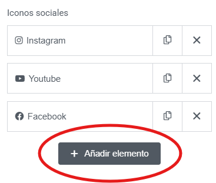
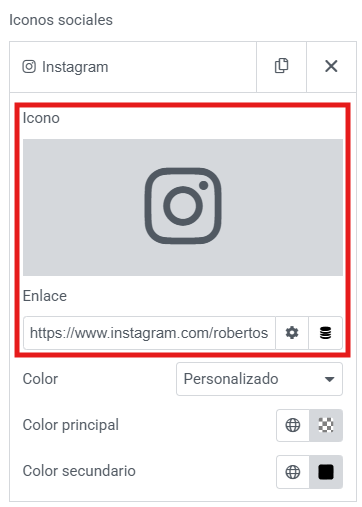
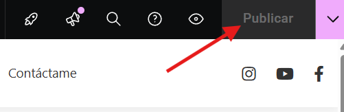

# Añadir una nueva red social
---
Puede añadir redes sociales en el footer de la siguiente manera:

**Paso 1**: Pase el rato por encima de la opcion **Editar con elementor** que encontrara en la **parte superior** de la pagina. Al hacerlo le aparecera un menu desplegable con diferentes opciones. Haga click en la opcion que dice **Footer - Main**.

---

**Paso 2**: Seleccione la sección para editar las redes sociales. Para ello, hay 2 maneras de hacerlo. La primera es **clicando encima** de las redes sociales. La segunda es **desde estructura**. 
**Opcion 1**:

**Opción 2**:

---

**Paso 3**: Haga click en el boton de **Añadir elemento**.

---

**Paso 4**: Inserte el **logo y el URL** de su red social.

---

**Paso 5**: Es **importante** que se asegure de guardar los cambios realizados. Para ello, **haga click** en el boton de **publicar** que encontrara en la parte superior derecha de la pagina.
