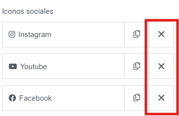

# Eliminar una red social
---
Puede eliminar las redes sociales del footer de la siguiente manera:

**Paso 1**: Pase el rato por encima de la opcion **Editar con elementor** que encontrara en la **parte superior** de la pagina. Al hacerlo le aparecera un menu desplegable con diferentes opciones. Haga click en la opcion que dice **Footer - Main**.

---

**Paso 2**: Seleccione la sección para editar las redes sociales. Para ello, hay 2 maneras de hacerlo. La primera es **clicando encima** de las redes sociales. La segunda es **desde estructura**. 
**Opcion 1**:

---
**Opción 2**:

---

**Paso 3**: Elimine la red social que dese quitar.

---

**Paso 4**: Es **importante** que se asegure de guardar los cambios realizados. Para ello, **haga click** en el boton de **publicar** que encontrara en la parte superior derecha de la pagina.
