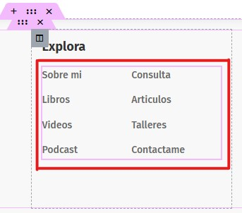
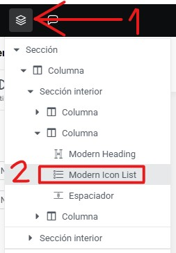
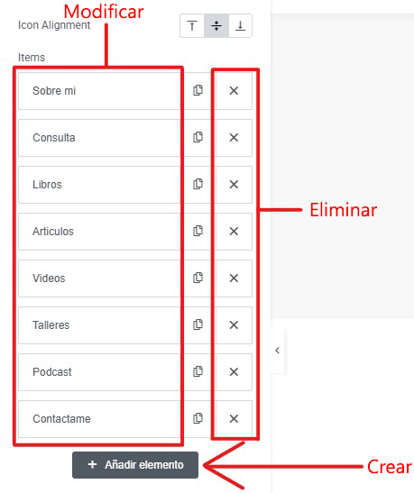
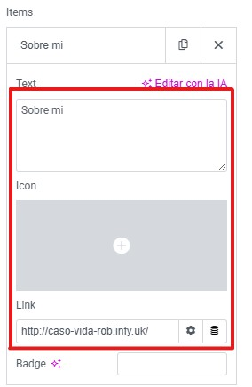

# Modificar los redireccionamientos
---
Puedo modificar los redireccionamientos a otras paginas desde el footer de la siguiente manera:

**Paso 1**: Pase el rato por encima de la opcion **Editar con elementor** que encontrara en la **parte superior** de la pagina. Al hacerlo le aparecera un menu desplegable con diferentes opciones. Haga click en la opcion que dice **Footer - Main**.

---

**Paso 2**: Seleccione la sección para editar los redireccionamientos. Para ello, hay 2 maneras de hacerlo. La primera es **clicando encima** de los redireccionamientos. La segunda es **desde estructura**. 
**Opcion 1**:

**Opción 2**:

---

**Paso 3**: Puede crear, modificar o eliminar los redireccionamientos **haciendo click** en las en las siguientes partes, de la misma forma que se ven en la siguiente imagen:
**Importante**: Tras realizar este paso, si lo que quiere es crear o modificar un redireccionamiento, continue realizando los siguientes paso. Si quiere eliminarlo, vaya direcctamente al paso 5. 
 

---

**Paso 4**: Inserte o modifique el **texto o el icono** en el que se tendra que hacer click para ser redireccionado. Despues, inserte o modifique **el link** al cual sera redireccionado. 

---

**Paso 5**: Una vez alla terminado de crear, modificar, o eliminar todos los redireccionamientos deseados, es **importante** asegurarse de guardar los cambios realizados. Para ello, **haga click** en el boton de publicar que encontrara en la **parte superior derecha** de la pagina.
