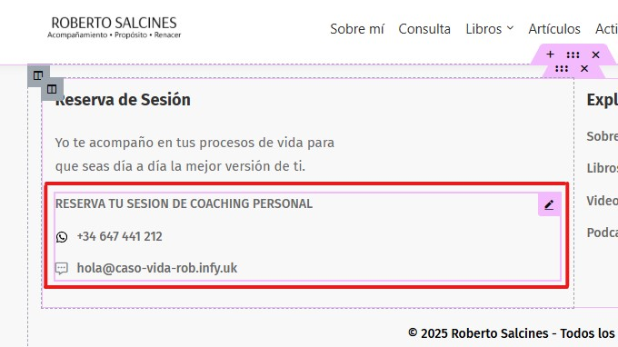
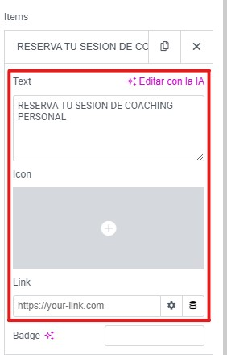

# Modificar los texto de contactos
---
Puede modificar el area donde aparecen las diferentes formas para contactarlo a usted del footer de la siguiente manera.

**Paso 1**: Pase el rato por encima de la opcion **Editar con elementor** que encontrara en la **parte superior** de la pagina. Al hacerlo le aparecera un menu desplegable con diferentes opciones. Haga click en la opcion que dice **Footer - Main**.

---

**Paso 2**: Seleccione la sección donde aparecen los diferentes medios de contacto. La primera es **clicando encima** de dicha sección. La segunda es **desde estructura**. 
**Opcion 1**:

---
**Opción 2**:

---

**Paso 3**: Puede crear, modificar o eliminar las diferentes formas para contactarlo a usted **haciendo click** en las en las siguientes partes, de la misma forma que se ven en la siguiente imagen:
**Importante**: Tras realizar este paso, si lo que quiere es crear o modificar una forma para contactarlo, continue realizando los siguientes paso. Si quiere eliminarlo, vaya direcctamente al paso 5. 
 

---

**Paso 4**: Inserte o modifique el **texto o el icono** de la forma de contacto. Despues, **si lo desea**, puede insertar o modificar **el link** al cual sera redireccionado relacionado con la forma del contacto. 

---

**Paso 5**: Una vez alla terminado de crear, modificar, o eliminar todos los redireccionamientos deseados, es **importante** asegurarse de guardar los cambios realizados. Para ello, **haga click** en el boton de publicar que encontrara en la **parte superior derecha** de la pagina.
