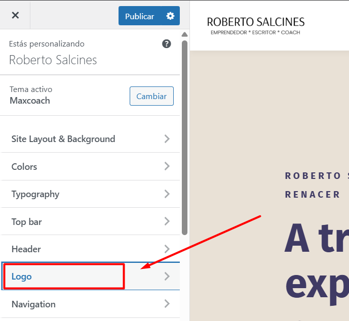
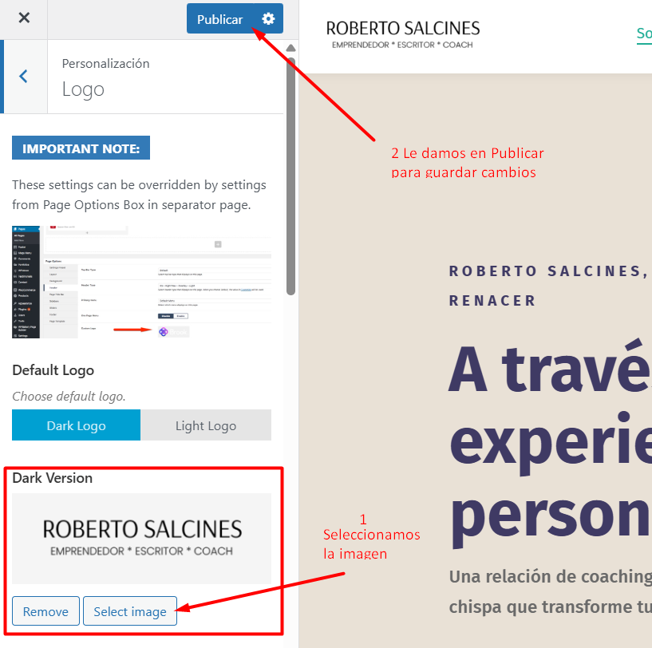

# Cambiar Logo del Sitio Web
---
Para cambiar el Logo debemos dirigirnos a:

**Paso 1**: En el Panel izquierdo buscamos **Apariencia** > **Personalizar**.

---

**Paso 2**: Buscamos el apartado de **Logo**.

**Paso 3**: Aqui solamente debemos Sustitular la imagen por la que queremos, presionando en **Select Image** y luego le damos en **Publicar**.
