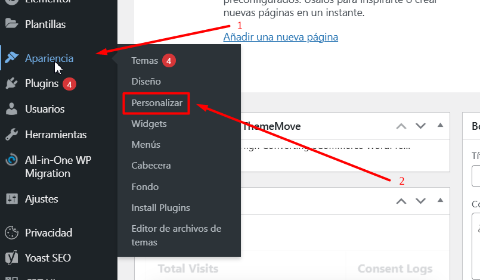
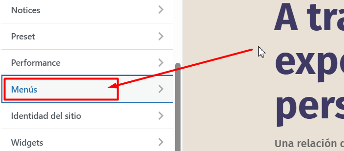
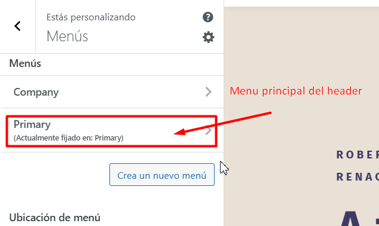
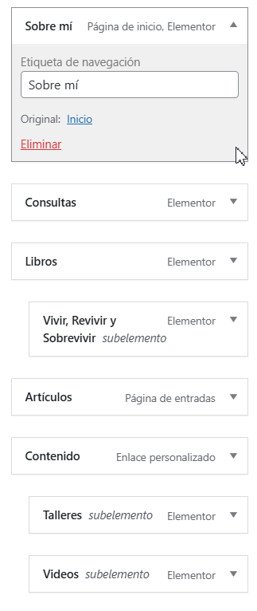
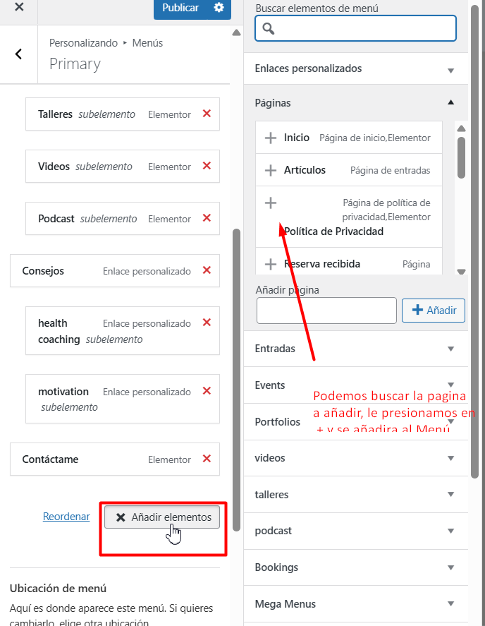

# Cambiar Menu Header
---
Para poder hacer ajustes en el Menu del Header debemos ir:

**Paso 1**: En el Panel izquierdo buscamos **Apariencia** > **Personalizar**.

---

**Paso 2**: Buscamos el apartado de **Menús**.

**Paso 3**: Aqui seleccionamos el **Primary**.

**Paso 4**: Aqui podemos ver los botones que tiene el Menú, podemos ordenadorlos seleccionando y moviendo entre ellos, **Borrar** o **Renombrar**.

**Paso 5**: Si queremos añadir uno nuevo, debemos presionar en **Añadir elementos** y nos saldra un panel al la derecha en donde debemos buscar y seleccionar la Página que quisieramos añadir, y luego deberas ubicarlo el orden de preferencia.

