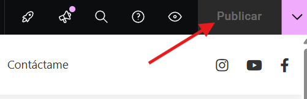
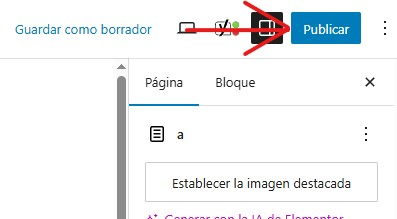

# Crear nuevas paginas
---
Puede crear nuevas paginas de la siguiente manera:

**Paso 1**: En el escritorio de wordpress, pase el raton **por encima** del apartado de paginas. Al hacerlo, le aparecera un menu desplegable. **Haga click** donde ponga **Añadir página**.

---

**Paso 2**: Añada el contenido de la pagina. Para ello puede editarla de forma normal, o puede editarla con elementor. **Importate**: Es recomendable usar elementor, porque este ultimo tiene mas y mejores opciones para crear una pagina.

---

**Paso 3**: Una vez alla terminado de crear su pagina, es **importante** asegurarse de guardar los cambios realizados. Para ello, **haga click** en el boton de publicar que encontrara en la **parte superior derecha** de la pagina.
**Desde Edición Normal**:

**Desde Edición Con Elementor**:
