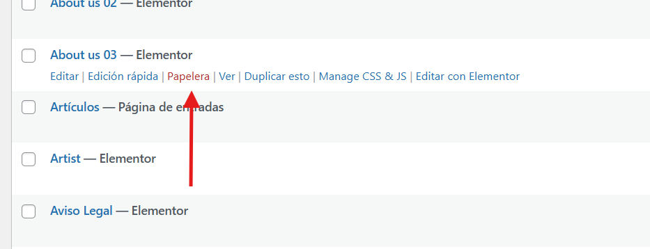

# Eliminar paginas
---
Puede eliminar paginas de la siguiente manera:

**Paso 1**: En el escritorio de wordpress, **haga click** en el apartado de paginas.

---

**Paso 2**: Pase el raton **por encima** de la pagina que desea eliminar. Al hacerlo, apareceran varias opciones diferentes debajo del nombre de dicha pagina. **Haga click** en la opción de eliminar.
