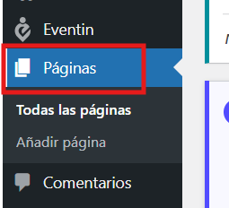
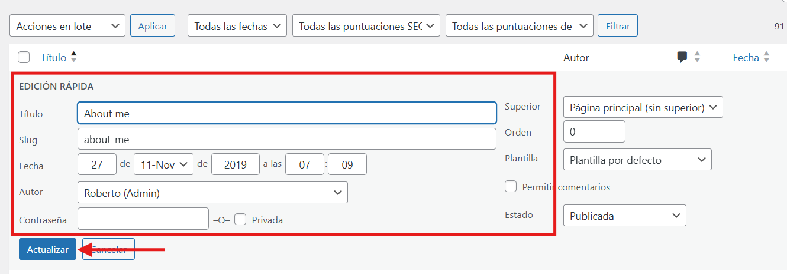
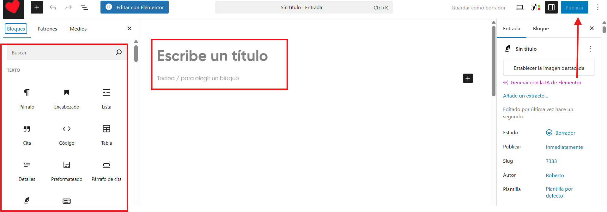
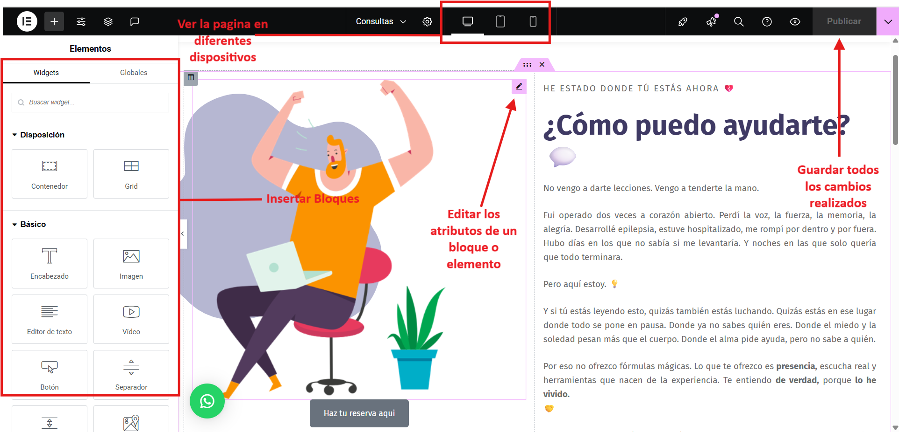

# Modificar paginas
---
Puede modificar las paginas de la siguiente manera:

**Paso 1**: En el escritorio de wordpress, **haga click** en el apartado de paginas.

---

**Paso 2**: Eliga de que modo lo quiere editar. Hay 3 modos de edicion. Edición rápida, editar y editar con elementor. 
**Edición Rápida**: En edicion rapida podras editar el titulo, el slug, la fecha en la que se ha creado, el autor de la pagina, el estado de la pagina e incluso añadirle una contraseña. **Importante**: Asegurese de guardar todos los cambios realizados, haciendo click en el boton de **Actualizar**.

---

**Editar**: En editar podras editar los contenidos de la pagina y añadir bloques de forma basica. **Importante**: Es mas recomendable usar **Elementor** debido a que es mas completa a la hora de editar la pagina, porque ofrece mas y mejores opciones para editarla. **Asegurese** de guardar todos los cambios realizados haciendo click encima del boton de **publicar** que encontrara en la **parte superior derecha** de la pagina.

---

**Editar con Elementor**: Este es el modo de editar paginas mas utilizado en wordpress. Es el que mas y mejores opciones permite. Para insertar nuevos bloques, seleccione el bloque deseado y arrastrelo hasta donde desea colocarlo. Cada bloque tiene funciones diferentes que le seran de ayuda modificando su pagina. Para editar un bloque o elemento en concreto, haga click encima de dicho bloque o elemento. Tambien puede cambiar el punto de vista para ver como se veria la pagina en diferentes tipos de dispositivos en la parte superior central de la pagina. **Importante**: Asegurese de guardar todos los cambios realizados **haciendo click** en el boton de **publicar** que encontrara en la **parte superior derecha de la pagina**.
