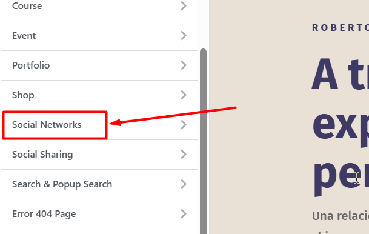

# Editar Redes Sociales (Menú Header)

Para añadir, editar enlace o eliminar elementos de las redes sociales ubicadas en el header debemos irnos a:

**Paso 1**: En el Panel izquierdo buscamos **Apariencia** > **Personalizar**.

**Paso 2**: Luego buscamos el apartado de **Social Networks**.

**Paso 3**: Una vez dentro podemos Editar una red social o añadir, en 
