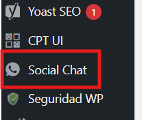
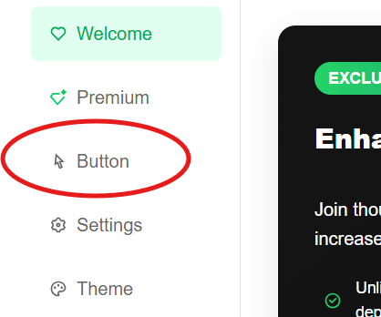
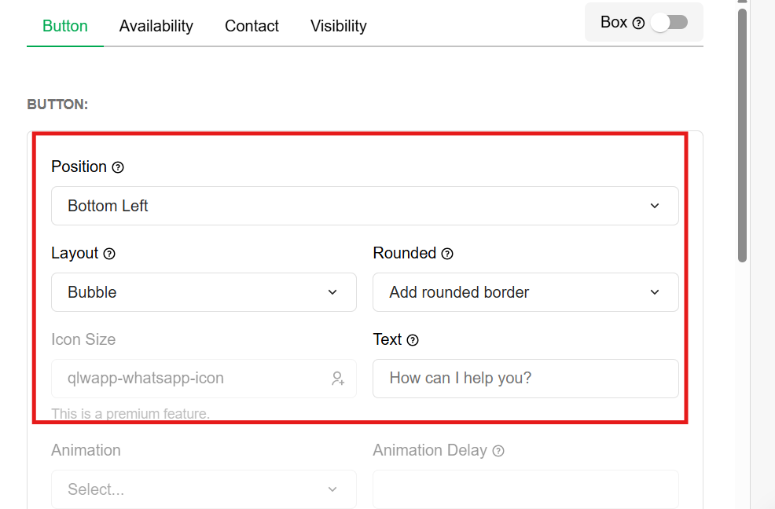
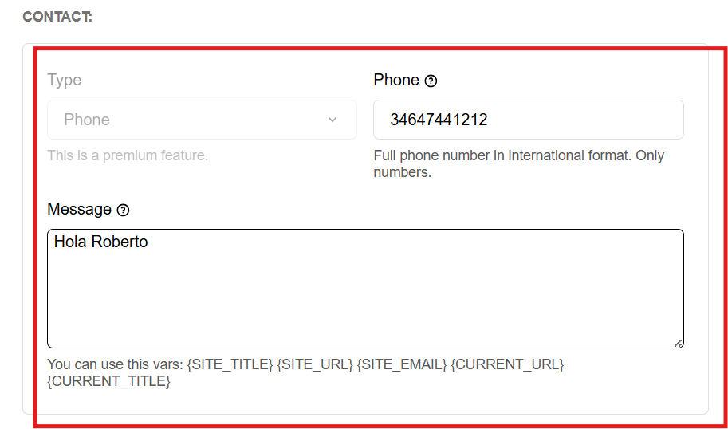

# Editar Boton de Whatsapp
---
Puede editar el boton de whattsap de su pagina de wordpress de la siguiente manera:

**Paso 1**: En el escritorio de wordpress, busque una sección llamada **Social Chat**.

---

**Paso 2**: Haga click en el apartado de **Button**.

---

**Paso 3**: Configure como se vera visualmente el boton de whattsap.

---

**Paso 4**: Inserte o modifique su numero de telefono y el texto que les aparecera por defecto en la zona de escribir para mandarselo a usted. 
